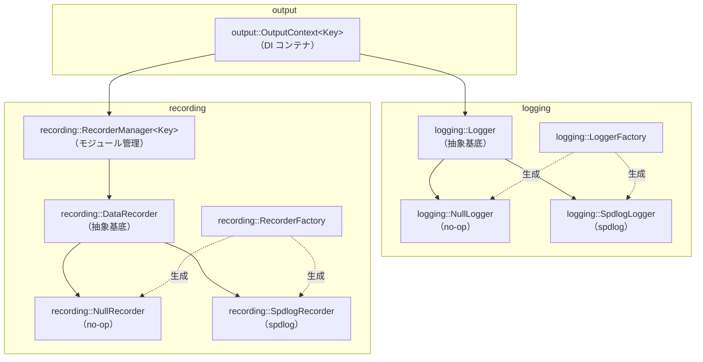

# 出力システム設計ドキュメント

## 概要

科学技術計算シミュレータにおいて、**診断ログ**と**解析データ**を分離しつつ統一的に管理する出力システム。

設計上の目標：

- DI（依存性注入）によりアプリケーションコアを出力実装から分離する
- モジュール単位でデータ出力の有効・無効を切り替える
- 出力先（ファイル・コンソール等）を柔軟に構成できる
- 将来的な並列実行（OpenMP / MPI）対応を考慮する

---

## 全体アーキテクチャ

```text
Application Core
      │
      ▼
output::OutputContext<Module>（DI）
 ├── logging::Logger（診断ログ）
 └── recording::RecorderManager<Module>
        ├── Module::X → recording::DataRecorder
        ├── Module::Y → recording::DataRecorder
        └── Module::Z → recording::DataRecorder
```

- 診断ログと解析データは完全に分離する
- 解析データはモジュール単位で独立した DataRecorder を持つ

---

## ファイル構成

- `include/template_cli_cpp/`
    - `logging/`
        - `logger.hpp` — `logging::Logger` 抽象基底クラス・`logging::LogLevel` 定義
        - `null_logger.hpp` — 何もしない実装
        - `spdlog_logger.hpp` — spdlog を使った実装
        - `logger_factory.hpp` — Logger インスタンス生成ファクトリ
    - `recording/`
        - `data_recorder.hpp` — `recording::DataRecorder` 抽象基底クラス・`Write()` ヘルパー
        - `null_recorder.hpp` — 何もしない実装
        - `spdlog_recorder.hpp` — spdlog を使った実装
        - `recorder_manager.hpp` — モジュール別管理
        - `recorder_factory.hpp` — DataRecorder インスタンス生成ファクトリ
    - `output/`
        - `output_context.hpp` — `logging::Logger` + `recording::RecorderManager` の DI コンテナ

テスト用:

- `tests/support/spy_logger.hpp` — メモリ蓄積によるテスト検証用 Logger 実装

---

## 責務分離

### logging::Logger（診断ログ）

- デバッグ・進行状況・エラー報告を担う
- ログレベル制御（trace / debug / info / warn / error / critical）
- 非同期対応可能
- 人間向けの可読テキストを出力する

### recording::DataRecorder（解析データ）

- 科学データをモジュール別に記録する
- Enable / Disable による出力制御（レベル概念なし）
- 出力フォーマットは raw（CSV 等、タイムスタンプ等のメタデータなし）

---

## インターフェース定義

### logging::Logger

```cpp
// include/template_cli_cpp/logging/logger.hpp

namespace logging {

enum class LogLevel : int { Trace = 0, Debug, Info, Warn, Error, Critical, Off };

class Logger {
public:
    virtual ~Logger() = default;

    virtual void Log(LogLevel level, std::string_view msg) = 0;
    virtual void SetLevel(LogLevel level) = 0;
    virtual LogLevel Level() const = 0;

    // 非仮想ヘルパー: コスト高い文字列生成をレベル確認後に行うために使う
    bool ShouldLog(LogLevel lvl) const { return lvl >= Level(); }
};

} // namespace logging
```

### recording::DataRecorder

```cpp
// include/template_cli_cpp/recording/data_recorder.hpp

namespace recording {

class DataRecorder {
public:
    virtual ~DataRecorder() = default;

    virtual void Enable() = 0;
    virtual void Disable() = 0;
    virtual bool IsEnabled() const = 0;

    virtual void Output(std::string_view msg) = 0;
    virtual void Flush() = 0;

    // 非仮想ヘルパー: fmt でフォーマットしてから Output() に渡す
    template <typename... Args>
    void Write(fmt::format_string<Args...> fmt_str, Args&&... args);
};

} // namespace recording
```

#### Write() の設計方針

`Output(string_view)` は文字列を受け取るだけなのでラッパー経由では fmt のフォーマット機能が失われる。
これを解決するため、非仮想テンプレートの `Write()` を提供する。

```cpp
recorder.Write("{},{:.6f}", step, value);
```

- フォーマット文字列は `fmt::format_string` によりコンパイル時にチェックされる
- `IsEnabled()` が false の場合は `fmt::format` 自体をスキップする（フォーマットコスト不要）
- 仮想関数は `Output(string_view)` のみなので、テスト・モックが容易

---

## クラス構成



---

## 各クラスの詳細

### logging::Logger 実装クラス

| クラス                    | ファイル            | 用途                      |
| ------------------------- | ------------------- | ------------------------- |
| `logging::NullLogger`     | `null_logger.hpp`   | 何もしない、DI デフォルト |
| `logging::SpdlogLogger`   | `spdlog_logger.hpp` | spdlog 同期・非同期       |
| `SpyLogger`（tests/）     | `spy_logger.hpp`    | メモリ蓄積、テスト検証用  |

### recording::DataRecorder 実装クラス

| クラス                      | ファイル              | 用途                                 |
| --------------------------- | --------------------- | ------------------------------------ |
| `recording::NullRecorder`   | `null_recorder.hpp`   | 何もしない、DI デフォルト            |
| `recording::SpdlogRecorder` | `spdlog_recorder.hpp` | spdlog ファイル出力（`%v` パターン） |

SpdlogRecorder はコンストラクタ時に `set_pattern("%v")` を設定し、メッセージのみを出力する（タイムスタンプ等を付加しない）。初期状態は disabled。

### recording::RecorderManager\<Key\>

enum class をキーにして複数の DataRecorder を管理する。

```cpp
template <typename Key>
class recording::RecorderManager {
public:
    void RegisterRecorder(Key key, std::shared_ptr<DataRecorder> recorder);
    DataRecorder& operator[](Key key);            // 未登録は out_of_range
    const DataRecorder& operator[](Key key) const;
    void FlushAll();
};
```

### output::OutputContext\<Key\>

Logger と RecorderManager を一つにまとめ、アプリケーションコアへ DI で注入する。

```cpp
template <typename Key>
class output::OutputContext {
public:
    OutputContext(logging::Logger& logger, recording::RecorderManager<Key>& recorders);
    logging::Logger& GetLogger();
    recording::RecorderManager<Key>& GetRecorders();
};
```

---

## ファクトリ

ファクトリは spdlog の初期化手順を呼び出し側から隠蔽する。

### logging::LoggerFactory

```cpp
// ファイルへ書き込む同期ロガー
auto logger = logging::LoggerFactory::MakeFile("app", "app.log", logging::LogLevel::Info);

// 標準出力（カラー付き）
auto logger = logging::LoggerFactory::MakeConsole("app", logging::LogLevel::Debug);

// 何も出力しない
auto logger = logging::LoggerFactory::MakeNull();
```

### recording::RecorderFactory

```cpp
// ファイルへ書き込む同期レコーダー（初期状態は disabled）
auto rec = recording::RecorderFactory::MakeFile("moduleX", "moduleX.csv");
rec->Enable();

// CSV ファイル（ヘッダ行を自動出力）
auto csv = recording::RecorderFactory::MakeCsvFile("results", "results.csv", "step,value");

// JSON Lines (NDJSON) ファイル
auto jl = recording::RecorderFactory::MakeJsonLinesFile("results", "results.jsonl");

// 何も出力しない
auto rec = recording::RecorderFactory::MakeNull();
```

---

## fmt と spdlog の依存関係

spdlog はデフォルトで fmt をバンドルするが、`SPDLOG_FMT_EXTERNAL=ON` を設定することで
プロジェクトが別途導入した `fmt::fmt` を共有できる。

```cmake
# cmake/dependencies-app.cmake
set(SPDLOG_FMT_EXTERNAL ON CACHE BOOL "" FORCE)
FetchContent_MakeAvailable(spdlog)
```

これにより：

- バイナリ内に fmt は1インスタンスだけになる（ODR 違反なし）
- `data_recorder.hpp` の `#include <fmt/format.h>` と spdlog が同じ fmt ライブラリを参照する

---

## 初期化例

```cpp
#include "template_cli_cpp/logging/logger_factory.hpp"
#include "template_cli_cpp/output/output_context.hpp"
#include "template_cli_cpp/recording/recorder_factory.hpp"
#include "template_cli_cpp/recording/recorder_manager.hpp"

enum class Module { X, Y, Z };

// 診断ロガー
auto logger = logging::LoggerFactory::MakeFile("diag", "diag.log", logging::LogLevel::Info);

// モジュール別レコーダー
recording::RecorderManager<Module> manager;
manager.RegisterRecorder(Module::X, recording::RecorderFactory::MakeFile("moduleX", "moduleX.csv"));
manager.RegisterRecorder(Module::Y, recording::RecorderFactory::MakeNull());

// OutputContext に統合して注入
output::OutputContext<Module> out(*logger, manager);
run(out);
```

---

## 使用例

```cpp
void run(output::OutputContext<Module>& out) {
    out.GetLogger().Log(logging::LogLevel::Debug, "initialize start");

    out.GetRecorders()[Module::X].Enable();
    out.GetRecorders()[Module::Y].Disable();

    for (int step = 0; step < 100; ++step) {
        double value = compute(step);

        // fmt::format_string によるコンパイル時チェック付きフォーマット
        out.GetRecorders()[Module::X].Write("{},{:.6f}", step, value);
    }

    out.GetRecorders()[Module::X].Flush();
}
```

---

## 非同期運用方針

| 用途       | 推奨                                 |
| ---------- | ------------------------------------ |
| 診断ログ   | 非同期推奨（SpdlogLogger async）     |
| 解析データ | 原則同期（順序保証・データ欠落防止） |

大量出力時のみ解析データの非同期化を検討する。

---

## 将来拡張

- `BufferedRecorder` — バッファリングして一括書き出し
- `BinaryRecorder` — バイナリ形式（HDF5 等）への出力
- `MPIRecorder` — MPI ランク別のファイル振り分け
- 設定ファイル駆動での初期化
