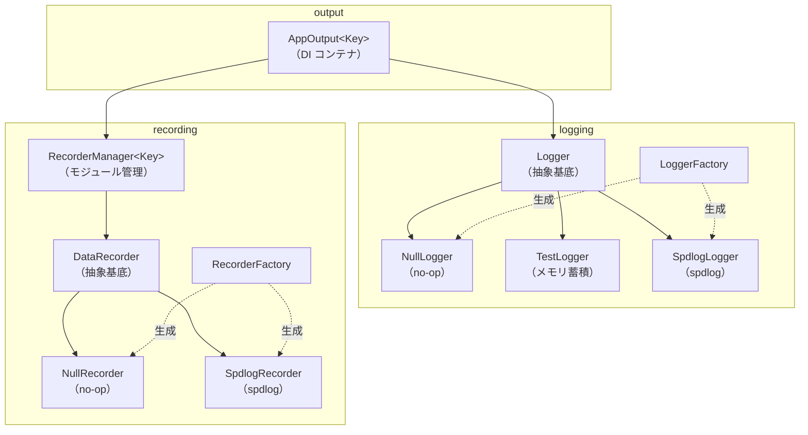

# 出力システム設計ドキュメント

## 概要

科学技術計算シミュレータにおいて、**診断ログ**と**解析データ**を分離しつつ統一的に管理する出力システム。

設計上の目標：

- DI（依存性注入）によりシミュレーションコアを出力実装から分離する
- モジュール単位でデータ出力の有効・無効を切り替える
- 出力先（ファイル・コンソール等）を柔軟に構成できる
- 将来的な並列実行（OpenMP / MPI）対応を考慮する

---

## 全体アーキテクチャ

```text
Application Core
      │
      ▼
AppOutput<Module>（DI）
 ├── Logger（診断ログ）
 └── RecorderManager<Module>
        ├── Module::X → DataRecorder
        ├── Module::Y → DataRecorder
        └── Module::Z → DataRecorder
```

- 診断ログと解析データは完全に分離する
- 解析データはモジュール単位で独立した DataRecorder を持つ

---

## ファイル構成

- `include/template_cli_cpp/`
    - `logging/`
        - `logger.hpp` — Logger 抽象基底クラス・LogLevel 定義
        - `null_logger.hpp` — 何もしない実装
        - `test_logger.hpp` — テスト用（メモリ蓄積）実装
        - `spdlog_logger.hpp` — spdlog を使った実装
        - `logger_factory.hpp` — Logger インスタンス生成ファクトリ
    - `recording/`
        - `data_recorder.hpp` — DataRecorder 抽象基底クラス・`write()` ヘルパー
        - `null_recorder.hpp` — 何もしない実装
        - `spdlog_recorder.hpp` — spdlog を使った実装
        - `recorder_manager.hpp` — モジュール別管理
        - `recorder_factory.hpp` — DataRecorder インスタンス生成ファクトリ
    - `output/`
        - `app_output.hpp` — Logger + RecorderManager の DI コンテナ

---

## 責務分離

### Logger（診断ログ）

- デバッグ・進行状況・エラー報告を担う
- ログレベル制御（trace / debug / info / warn / error / critical）
- 非同期対応可能
- 人間向けの可読テキストを出力する

### DataRecorder（解析データ）

- 科学データをモジュール別に記録する
- enable / disable による出力制御（レベル概念なし）
- 出力フォーマットは raw（CSV 等、タイムスタンプ等のメタデータなし）

---

## インターフェース定義

### Logger

```cpp
// include/template_cli_cpp/logging/logger.hpp

enum class LogLevel : int { Trace = 0, Debug, Info, Warn, Error, Critical, Off };

class Logger {
public:
    virtual ~Logger() = default;

    virtual void log(LogLevel level, std::string_view msg) = 0;
    virtual void set_level(LogLevel level) = 0;
    virtual LogLevel level() const = 0;

    // 非仮想ヘルパー: コスト高い文字列生成をレベル確認後に行うために使う
    bool should_log(LogLevel lvl) const { return lvl >= level(); }
};
```

### DataRecorder

```cpp
// include/template_cli_cpp/recording/data_recorder.hpp

class DataRecorder {
public:
    virtual ~DataRecorder() = default;

    virtual void enable() = 0;
    virtual void disable() = 0;
    virtual bool is_enabled() const = 0;

    virtual void output(std::string_view msg) = 0;
    virtual void flush() = 0;

    // 非仮想ヘルパー: fmt でフォーマットしてから output() に渡す
    template <typename... Args>
    void write(fmt::format_string<Args...> fmt_str, Args&&... args);
};
```

#### write() の設計方針

`output(string_view)` は文字列を受け取るだけなのでラッパー経由では fmt のフォーマット機能が失われる。
これを解決するため、非仮想テンプレートの `write()` を提供する。

```cpp
recorder.write("{},{:.6f}", step, value);
```

- フォーマット文字列は `fmt::format_string` によりコンパイル時にチェックされる
- `is_enabled()` が false の場合は `fmt::format` 自体をスキップする（フォーマットコスト不要）
- 仮想関数は `output(string_view)` のみなので、テスト・モックが容易

---

## クラス構成



---

## 各クラスの詳細

### Logger 実装クラス

| クラス         | ファイル            | 用途                      |
| -------------- | ------------------- | ------------------------- |
| `NullLogger`   | `null_logger.hpp`   | 何もしない、DI デフォルト |
| `TestLogger`   | `test_logger.hpp`   | メモリ蓄積、テスト検証用  |
| `SpdlogLogger` | `spdlog_logger.hpp` | spdlog 同期・非同期       |

### DataRecorder 実装クラス

| クラス           | ファイル              | 用途                                 |
| ---------------- | --------------------- | ------------------------------------ |
| `NullRecorder`   | `null_recorder.hpp`   | 何もしない、DI デフォルト            |
| `SpdlogRecorder` | `spdlog_recorder.hpp` | spdlog ファイル出力（`%v` パターン） |

SpdlogRecorder はコンストラクタ時に `set_pattern("%v")` を設定し、メッセージのみを出力する（タイムスタンプ等を付加しない）。初期状態は disabled。

### RecorderManager\<Key\>

enum class をキーにして複数の DataRecorder を管理する。

```cpp
template <typename Key>
class RecorderManager {
public:
    void register_recorder(Key key, std::shared_ptr<DataRecorder> recorder);
    DataRecorder& operator[](Key key);            // 未登録は out_of_range
    const DataRecorder& operator[](Key key) const;
    void flush_all();
};
```

### AppOutput\<Key\>

Logger と RecorderManager を一つにまとめ、シミュレーションコアへ DI で注入する。

```cpp
template <typename Key>
class AppOutput {
public:
    AppOutput(Logger& logger, RecorderManager<Key>& recorders);
    Logger& logger();
    RecorderManager<Key>& recorders();
};
```

---

## ファクトリ

ファクトリは spdlog の初期化手順を呼び出し側から隠蔽する。

### LoggerFactory

```cpp
// ファイルへ書き込む同期ロガー
auto logger = LoggerFactory::make_file("app", "app.log", LogLevel::Info);

// 標準出力（カラー付き）
auto logger = LoggerFactory::make_console("app", LogLevel::Debug);

// 何も出力しない
auto logger = LoggerFactory::make_null();
```

### RecorderFactory

```cpp
// ファイルへ書き込む同期レコーダー（初期状態は disabled）
auto rec = RecorderFactory::make_file("moduleX", "moduleX.csv");
rec->enable();

// 何も出力しない
auto rec = RecorderFactory::make_null();
```

---

## fmt と spdlog の依存関係

spdlog はデフォルトで fmt をバンドルするが、`SPDLOG_FMT_EXTERNAL=ON` を設定することで
プロジェクトが別途導入した `fmt::fmt` を共有できる。

```cmake
# cmake/dependencies-app.cmake
set(SPDLOG_FMT_EXTERNAL ON CACHE BOOL "" FORCE)
FetchContent_MakeAvailable(spdlog)
```

これにより：

- バイナリ内に fmt は1インスタンスだけになる（ODR 違反なし）
- `data_recorder.hpp` の `#include <fmt/format.h>` と spdlog が同じ fmt ライブラリを参照する

---

## 初期化例

```cpp
#include "template_cli_cpp/logging/logger_factory.hpp"
#include "template_cli_cpp/output/app_output.hpp"
#include "template_cli_cpp/recording/recorder_factory.hpp"
#include "template_cli_cpp/recording/recorder_manager.hpp"

enum class Module { X, Y, Z };

// 診断ロガー
auto logger = LoggerFactory::make_file("diag", "diag.log", LogLevel::Info);

// モジュール別レコーダー
RecorderManager<Module> manager;
manager.register_recorder(Module::X, RecorderFactory::make_file("moduleX", "moduleX.csv"));
manager.register_recorder(Module::Y, RecorderFactory::make_null());

// AppOutput に統合して注入
AppOutput<Module> out(*logger, manager);
run(out);
```

---

## 使用例

```cpp
void run(AppOutput<Module>& out) {
    out.logger().log(LogLevel::Debug, "initialize start");

    out.recorders()[Module::X].enable();
    out.recorders()[Module::Y].disable();

    for (int step = 0; step < 100; ++step) {
        double value = compute(step);

        // fmt::format_string によるコンパイル時チェック付きフォーマット
        out.recorders()[Module::X].write("{},{:.6f}", step, value);
    }

    out.recorders()[Module::X].flush();
}
```

---

## 非同期運用方針

| 用途       | 推奨                                           |
| ---------- | ---------------------------------------------- |
| 診断ログ   | 非同期推奨（SpdlogLogger async）               |
| 解析データ | 原則同期（順序保証・データ欠落防止）           |

大量出力時のみ解析データの非同期化を検討する。

---

## 将来拡張

- `TestRecorder` — メモリ蓄積によるテスト検証用
- `BufferedRecorder` — バッファリングして一括書き出し
- `BinaryRecorder` — バイナリ形式（HDF5 等）への出力
- `MPIRecorder` — MPI ランク別のファイル振り分け
- 設定ファイル駆動での初期化
